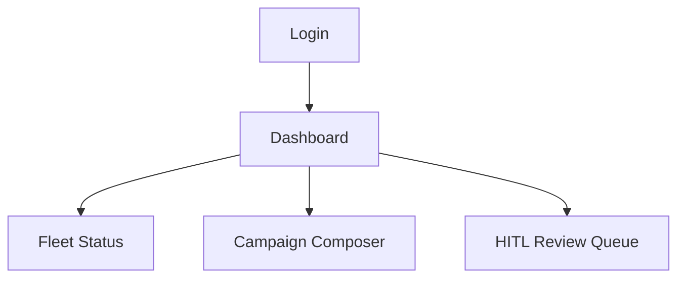

# Frontend Specifications – Dashboard & HITL Interface

## Vision
React-based dashboard for Operators (campaigns) and HITL Moderators (review queue).

## User Stories
As a Network Operator, I need to:
- View fleet status (agents, queues, wallet balances) so I can monitor health.
- Create campaigns via natural language so Planner decomposes goals.

As a HITL Moderator, I need to:
- See escalated content (low-confidence/sensitive) so I can approve/reject.
- Edit agent output so brand safety is maintained.

## Tech Stack
- React + Vite + Tailwind CSS
- State: Zustand or Redux
- API: REST/GraphQL to Orchestrator

## Wireframe (Mermaid)

